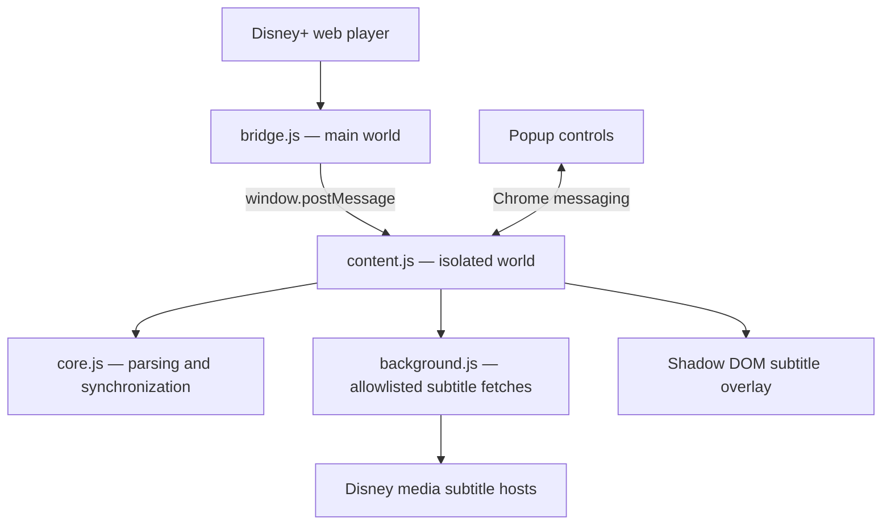

# Disney+ Dual Subtitles

An unofficial, privacy-focused Chrome/Edge Manifest V3 extension that displays
two synchronized subtitle tracks on the Disney+ web player.

> This project is not affiliated with, endorsed by, or sponsored by Disney or
> Disney+. Disney+ is a trademark of its respective owner.

## Highlights

- Discovers official subtitle tracks from Disney+ HLS manifests.
- Displays two official WebVTT tracks simultaneously.
- Supports independent font sizes and colors for the upper and lower lines.
- Handles play, pause, seeking, page reloads, fullscreen, and in-app navigation.
- Refreshes sliding subtitle playlists and merges newly available segments.
- Imports a local `.srt` or `.vtt` file as the lower subtitle track.
- Optionally hides the native Disney+ subtitle renderer.
- Processes subtitle text locally without downloading video or bypassing DRM.
- Uses no production dependencies and does not operate a backend service.

## Architecture



Chrome content scripts normally run in an isolated JavaScript world. The
main-world bridge observes playback resources and the timeline exposed to the
page, then forwards only the required metadata to the isolated content script.
The background service worker retrieves allowlisted subtitle resources, while
the pure functions in `core.js` parse and synchronize cues.

## How subtitle delivery is handled

Disney+ delivers subtitles through HLS rather than as one complete file. A
master manifest identifies language tracks, and each subtitle media playlist
references small WebVTT segments. These media playlists may be sliding windows
whose contents change as playback advances.

The extension therefore:

1. Detects subtitle manifests and language metadata.
2. Parses WebVTT segments and their MPEGTS timing information.
3. Caches segments by full URL and removes duplicate cues.
4. Periodically refreshes selected subtitle playlists.
5. Requests a new player timeline and refreshes playlists after seeking.
6. Merges rolling cue windows without discarding previously loaded captions.

## Project structure

| File | Responsibility |
| --- | --- |
| `manifest.json` | Manifest V3 metadata, permissions, and script registration |
| `bridge.js` | Main-world playback request and timeline observation |
| `content.js` | State management, seek recovery, settings, and overlay rendering |
| `core.js` | M3U8, WebVTT, SRT, MPEGTS, cue merge, and timing logic |
| `background.js` | Bounded and allowlisted subtitle-resource fetching |
| `popup.html/js/css` | User controls and presentation |
| `tests/` | Dependency-free Node.js tests |

## Requirements

### To use the extension

- A current desktop version of Google Chrome or Microsoft Edge
- A Disney+ account and access to the Disney+ web player
- Developer mode while installing the unpacked development build

### To develop or test

- Node.js 18 or newer
- npm, included with Node.js

There is no build step and no `npm install` is required for the current source.

## Install from source

1. Download or clone this repository.
2. Open `chrome://extensions` in Chrome or `edge://extensions` in Edge.
3. Enable **Developer mode**.
4. Select **Load unpacked**.
5. Choose the repository directory containing `manifest.json`.
6. Reload the Disney+ playback page and start a video.
7. Open the extension from the browser toolbar and select both tracks.

Disney+ exposes subtitle manifests during player initialization, so the
playback page must be reloaded after installing or updating the extension.

## Development

Run syntax validation:

```sh
npm run check
```

Run the automated test suite:

```sh
npm test
```

The tests cover manifest parsing, segmented playlists, WebVTT/SRT parsing,
MPEGTS mapping, duplicate removal, rolling subtitle windows, timeline updates,
and seek recovery.

## Permissions

- `storage`: stores display settings and preferred subtitle languages locally.
- `activeTab`: lets the popup communicate with and reload the active Disney+
  tab.
- `www.disneyplus.com`: observes the player and subtitle-manifest lifecycle.
- `*.media.dssott.com`: fetches subtitle resources referenced by the active
  playback session.

The extension does not request browsing-history, cookie, or all-sites access.
See [PRIVACY.md](PRIVACY.md) for the data-handling statement.

## Known limitations

- Supports the desktop Disney+ web player, not mobile or TV applications.
- Picture-in-Picture and cast devices cannot display a page-level custom overlay.
- Imported subtitle files are intentionally not persisted between playback routes.
- Availability of subtitle languages depends on title, region, and subscription.
- Disney+ player or CDN changes may require compatibility updates.

## Contributing and security

Contributions are welcome. Read [CONTRIBUTING.md](CONTRIBUTING.md) before opening
a pull request. Please report potential security issues according to
[SECURITY.md](SECURITY.md), rather than publishing sensitive details in an issue.

## License

Released under the [MIT License](LICENSE).

